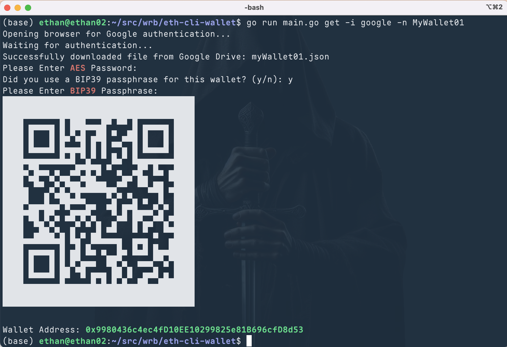

# Ethereum CLI Vault

A secure command-line wallet for Ethereum that supports multiple key storage providers.


<a href="https://t.me/ethanatca"></a>
<a href="https://x.com/intent/follow?screen_name=0x99_Ethan">

</a>


## Problem Solved

How to back up your mnemonic phrase more securely? Write it on paper? Engrave it on steel? Scramble the order? Use a 25th word? Password cloud storage? Hardware wallet?
- Physical backups can be lost or damaged 
- Cloud storage risks being hacked

Security practice: Use AES and passphrase dual protection to back up across multiple cloud drives. Only need to remember two passwords - one to decrypt the 24 word mnemonic, and one to combine with the 24 words to restore the key.

[English](./README.md) | [中文](./README_cn.md) | [Documentation](https://ethans-place.gitbook.io/eth-cli-vault)

## Important Security Note

**All data files and credentials remain under your full control at all times.** This wallet puts you in complete control of your assets through self-custody:

- Wallet files are encrypted with your passwords before being stored
- Private keys are never shared with any third party
- Cloud storage providers cannot access your unencrypted data
- You are responsible for safely storing your wallet files and remembering your passwords
- No recovery mechanisms exist if you lose your encrypted files or passwords

Always keep multiple backups of your encrypted wallet files and ensure you never forget your passwords.

## Security Features

- BIP39 mnemonic phrase generation (24 words)
- Optional BIP39 passphrase support
- AES-256-GCM encryption with Argon2id key derivation
- Cloud storage support via OAuth (Google Drive, Dropbox, Box, AWS S3)
- Local wallet storage option
- **Apple Keychain storage support** - available as a storage option on macOS systems
- **No server component** - all OAuth token exchanges, cloud storage connections, and authorization processes happen solely on your local machine without any external server involvement. This program is fully client-side and will never have any server component.

## Screen



## Installation

### Binary Installation (Simplest)

```bash
# Download the latest release from the releases page
# For macOS (Apple Silicon)
curl -L -o eth-cli https://github.com/ethanzhrepo/eth-cli-vault/releases/download/v0.1.4/eth-cli-0.1.4-macos-Silicon
chmod +x eth-cli

# For Linux (x64/amd64)
curl -L -o eth-cli https://github.com/ethanzhrepo/eth-cli-vault/releases/download/v0.1.4/eth-cli-0.1.4-linux-amd64
chmod +x eth-cli

# For Linux (arm64)
curl -L -o eth-cli https://github.com/ethanzhrepo/eth-cli-vault/releases/download/v0.1.4/eth-cli-0.1.4-linux-arm64
chmod +x eth-cli

# For Windows
# Download from the releases page and rename to eth-cli.exe
# https://github.com/ethanzhrepo/eth-cli-vault/releases/download/v0.1.4/eth-cli-0.1.4-windows-amd64.exe

# For macOS (Intel)
# We recommend building from source for Intel Macs (see Building from Source section below)
```

### Building from Source

```bash
# Installing from source
git clone https://github.com/ethanzhrepo/eth-cli-vault
cd eth-cli-vault

# Set up environment variables
cp .env.example .env
# Edit .env file to add your cloud storage provider keys
# nano .env or vim .env

# Build using make
make

# The compiled binaries will be in the release directory
# You can copy the appropriate binary for your system
cp release/eth-cli-0.1.4-macos-Silicon eth-cli  # For macOS Apple Silicon
# or
cp release/eth-cli-0.1.4-linux-amd64 eth-cli  # For Linux
```

### Environment Variables for Cloud Storage

If you plan to use cloud storage, you'll need to configure OAuth credentials. Set the following environment variables:

```bash
# Google Drive
export GOOGLE_OAUTH_CLIENT_ID="your-client-id"
export GOOGLE_OAUTH_CLIENT_SECRET="your-client-secret"

# Dropbox
export DROPBOX_APP_KEY="your-app-key"

# Box
export BOX_CLIENT_ID="your-client-id"
export BOX_CLIENT_SECRET="your-client-secret"

# AWS S3
export AWS_ACCESS_KEY_ID="your-access-key"
export AWS_SECRET_ACCESS_KEY="your-secret-key"
export AWS_REGION="your-region"
export AWS_S3_BUCKET="your-bucket-name"
```

**Note:** The binary installation comes with pre-configured environment variables for cloud storage services. However, if you have the ability to register your own developer accounts with these services, it's recommended to replace these with your own credentials by setting the environment variables in your system. This gives you full control over the cloud storage integration.

If you don't want to set up cloud storage credentials, you can still use the wallet with local files only. The wallet files are encrypted and can be manually uploaded to any cloud storage service of your choice. The AES encryption protects your wallet data even if stored in untrusted locations.

**macOS users note:** On macOS systems, you can choose to use Apple Keychain as a storage option, which offers additional benefits of system-level security integration. Keychain storage is optional and like other cloud storage options, it needs to be explicitly specified in commands.

## Configuration

```bash
# Set RPC URL (required for blockchain operations)
./eth-cli config set rpc https://your-ethereum-rpc-url

# List all configuration settings
./eth-cli config list

# Get specific configuration value
./eth-cli config get rpc

# Delete configuration value
./eth-cli config delete rpc
```

## Creating a Wallet

```bash
# Save to cloud storage (without saving locally)
./eth-cli create --output google,box,dropbox --name myWallet [--force]
# Will save to /MyWallet/{name}.json in cloud storage

# Use Keychain storage on macOS
./eth-cli create --output keychain --name myWallet [--force]
# Securely stores in system keychain

# Save to cloud storage and local file
./eth-cli create --output /path/to/save/myWallet.json,google,box,dropbox --name myWallet
# Will save to cloud storage and specified local path

# Save only to local file (if you don't want to use cloud storage)
./eth-cli create --output fs --path /path/to/save/myWallet.json [--force]
# You can manually upload this encrypted file to any cloud storage

# Old method for local file (still supported)
./eth-cli create --output /path/to/save/myWallet.json --name myWallet
# You can manually upload this encrypted file to any cloud storage
```

When creating a wallet:
1. You'll be prompted to enter a BIP39 passphrase (optional, adds extra security)
2. You'll be required to set a strong AES password to encrypt the 24-word mnemonic

**Important:** Both the BIP39 passphrase and AES password are critical for accessing your wallet. If lost, your assets will be permanently inaccessible due to the strong encryption algorithms used.

**Password Requirements:** Both the AES password and BIP39 passphrase must include a combination of uppercase letters, lowercase letters, and numbers to ensure adequate security strength.

**Encryption Strength:** This wallet uses strong encryption with the following parameters:
- **Algorithm:** AES-256-GCM with Argon2id key derivation
- **Memory Required:** 1048576 KB (1GB) - Makes hardware-based attacks extremely difficult
- **Iterations:** 12 - Increases resistance to brute force attacks
- **Parallelism:** 4 - Adds computational overhead
- **Key Length:** 32 bytes (256 bits) - Full-strength AES-256 key

This encryption configuration requires significant computational resources to attempt breaking, making it practically impossible to access your wallet without the correct passwords, even with advanced hardware.

## Creating Vanity Address Wallets

The `create-special` command allows you to generate wallets with vanity addresses that match specific patterns using regular expressions. This process can take considerable time depending on the complexity of your pattern.

```bash
# Generate vanity address with pattern saved to cloud storage
./eth-cli create-special --pattern "^0x999[a-fA-F0-9]+999$" --output google,dropbox --name myVanityWallet [--force]

# Generate vanity address saved to local file
./eth-cli create-special --pattern "^0x999999[a-fA-F0-9]+999999$" --output fs --path /tmp/vanity_wallet.json [--force]

# Generate vanity address with multiple outputs and display mnemonic during generation
./eth-cli create-special --pattern "^0x[aA]+[0-9]{10}" --output google,dropbox,keychain --name myVanityWallet --display-mnemonic [--force]
```

**Command Options:**
- `--pattern` (required): Regular expression pattern to match the desired address format
- `--output` (required): Output location(s) - use 'fs' for local file, or comma-separated cloud providers
- `--name`: Name of the wallet file (required except when using `--output fs`)
- `--path`: File path for wallet when using `--output fs`
- `--display-mnemonic`: Show the mnemonic phrase when a matching address is found
- `--force`: Overwrite existing wallet files

**Pattern Examples:**
- `^0x999[a-fA-F0-9]+999$` - Address starting with 999 and ending with 999
- `^0x999999[a-fA-F0-9]+999999$` - Address starting and ending with 999999
- `^0x[aA]+[0-9]{10}` - Address starting with multiple A's followed by 10 digits
- `^0x[0-9]{8}` - Address starting with 8 digits

**Important Security Notes for Vanity Addresses:**
- ⚠️ **Passphrase is automatically set to empty** for vanity address generation to ensure address consistency
- The vanity generation process may take a very long time (hours to days) for complex patterns
- You can press Ctrl+C to cancel the generation at any time
- The wallet will still require a strong AES encryption password for file security
- Test your vanity wallet with the `get` command before using it for transactions

**Performance Considerations:**
- Simple patterns (4-6 specific characters) may take minutes to hours
- Complex patterns (8+ specific characters) may take days or weeks
- The more specific your pattern, the exponentially longer it will take
- Consider starting with simpler patterns to test the functionality

## Managing Wallets

```bash
# List all wallets from a storage provider
./eth-cli list --input google
./eth-cli list --input box
./eth-cli list --input dropbox
./eth-cli list --input keychain  # macOS only

# Get wallet address
./eth-cli get --input google --name myWallet
./eth-cli get --input keychain --name myWallet  # macOS only
./eth-cli get --input /path/to/wallet.json

# Get wallet address with additional options
./eth-cli get --input google --name myWallet --show-mnemonics --show-private-key

# Copy wallet between storage providers
./eth-cli copy --from google --to /path/to/local/backup.json --name myWallet
./eth-cli copy --from google --to dropbox --name myWallet
./eth-cli copy --from google --to box --name myWallet
./eth-cli copy --from google --to keychain --name myWallet  # Copy to keychain (macOS only)
./eth-cli copy --from /path/to/wallet.json --to google
```

## Getting Gas Price

```bash
./eth-cli gas-price
```

## Transactions

### Transfer ETH

```bash
./eth-cli transfer --amount 1.0eth --to 0xDestinationAddress --provider google --name myWallet [options]

# Options:
# --dry-run           Only create and display the raw transaction without broadcasting
# --estimate-only     Only display gas estimation without creating transaction
# --yes, -y           Automatically confirm transaction without prompting
# --gas-price 3gwei   Specify custom gas price
# --gas-limit 21000   Specify custom gas limit
# --sync              Wait for transaction confirmation
# --file /path/to/wallet.json    Use local wallet file instead of cloud provider
```